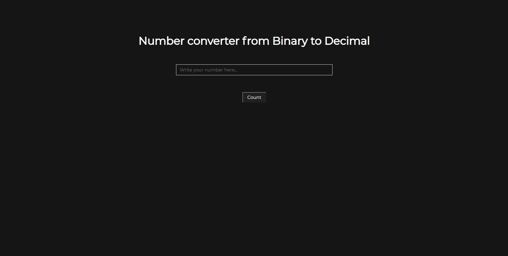
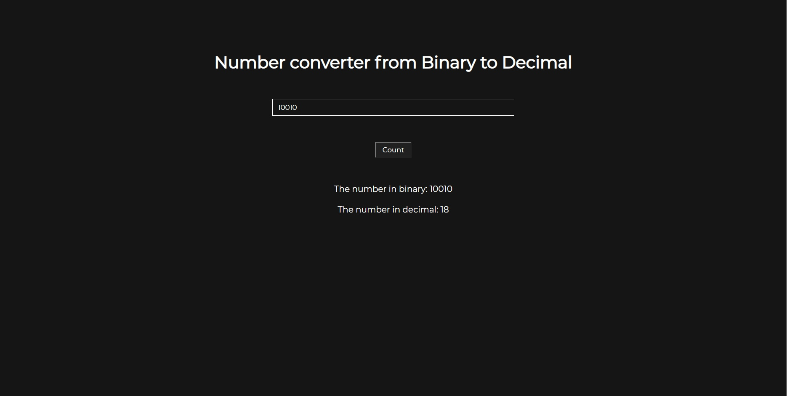

# Converter binary to decimal

📠 This is a simple binary-decimal converter 

It counts your entered bimary number and converts it to a decimal number 

For looking the work you should open file "main.html"  
